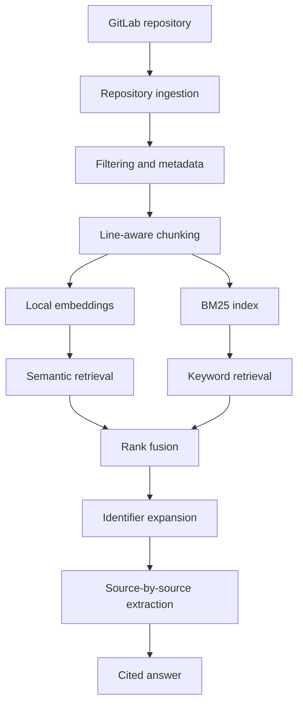

# RepoMentor

**A local, citation-grounded RAG assistant for understanding unfamiliar GitLab codebases.**

RepoMentor helps new developers explore a company’s repositories without reading every file manually. It ingests source code and documentation from GitLab, retrieves the code most relevant to a natural-language question, and uses a local language model to produce an evidence-backed answer with links to exact files, commits, and line ranges.

> **Project status:** Working command-line prototype. Retrieval evaluation, package-level modularization, automated synchronization, and a web interface are planned next.

## Why RepoMentor?

Joining a software team often requires learning several things at once:

- where important logic lives;
- how services and components interact;
- which conventions the team follows;
- how authentication, deployment, testing, and data access work;
- and why parts of the system changed over time.

README files help, but they rarely capture the full implementation. Generic chatbots can also produce plausible answers without sufficient evidence. RepoMentor addresses this by retrieving relevant repository content first and grounding every returned fact in a specific source location.

## What It Does

- Connects to private or public GitLab repositories through the GitLab REST API.
- Discovers and downloads supported source-code and documentation files.
- Excludes virtual environments, dependencies, generated files, build output, empty files, and other low-value content.
- Preserves project paths, blob IDs, commit IDs, file sizes, and source content.
- Splits files into overlapping, line-aware chunks for retrieval and citation.
- Generates embeddings locally with Sentence Transformers.
- Combines semantic similarity and BM25 keyword search.
- Expands searches deterministically using identifiers discovered in initially retrieved code.
- Uses Reciprocal Rank Fusion to merge semantic and keyword rankings.
- Reduces duplicate evidence by selecting chunks from different files.
- Uses a local Ollama model to extract facts from one source at a time.
- Appends citations programmatically instead of relying on the model to map citation numbers correctly.
- Links citations to the exact GitLab commit and line range.

## Architecture



## RAG Pipeline

### 1. Ingestion

RepoMentor authenticates to GitLab using a read-only token, lists the repository tree, downloads selected files, and stores the raw corpus as JSON Lines (`.jsonl`). Each record contains the file content and traceability metadata.

Example record:

```json
{
  "project_path": "username/demo-company-app",
  "file_path": "backend/app/core/security.py",
  "blob_id": "...",
  "last_commit_id": "...",
  "size": 1234,
  "content": "..."
}
```

### 2. Filtering

The current prototype accepts:

- Python;
- JavaScript and TypeScript;
- React TSX/JSX;
- Markdown;
- YAML;
- TOML;
- SQL;
- Dockerfiles.

It excludes directories such as `node_modules`, `.venv`, `dist`, `build`, `coverage`, and `vendor`. During processing, it also skips empty files, generated TypeScript clients, and oversized release-note content that could dominate retrieval.

### 3. Chunking

Files are split into chunks of up to **60 lines** with a **10-line overlap**. The overlap preserves context when an important function or explanation crosses a chunk boundary.

Each chunk retains:

- project path;
- file path;
- start and end line numbers;
- last commit ID;
- deterministic chunk ID;
- chunk content.

The initial sample run produced:

| Metric | Value |
| --- | ---: |
| Downloaded files | 188 |
| Download failures | 0 |
| Raw corpus size | 610.85 KB |
| Generated chunks | 324 |
| Skipped files | 26 |

### 4. Embeddings

RepoMentor uses `sentence-transformers/all-MiniLM-L6-v2` to represent each chunk as a **384-dimensional normalized vector**. The current corpus therefore produces an embedding matrix with shape `(324, 384)`.

For the prototype, embeddings are stored as a NumPy array. This keeps the retrieval mathematics transparent before introducing a dedicated vector database.

### 5. Hybrid Retrieval

RepoMentor combines two retrieval methods:

- **Semantic retrieval:** compares the question embedding with chunk embeddings using cosine similarity.
- **BM25 retrieval:** finds exact names and technical terms such as `verify_password` or `get_password_hash`.

The rankings are merged using **Reciprocal Rank Fusion (RRF)**. RepoMentor then examines strong initial matches, extracts related code identifiers, and performs a second deterministic retrieval pass. This helps bridge natural-language questions and implementation-specific names.

### 6. Grounded Generation

The current generator runs locally through Ollama using `qwen3:1.7b`. To reduce source confusion in a small model:

1. each retrieved source is processed independently;
2. the model extracts only facts directly supported by that source;
3. Python attaches the source citation automatically;
4. the final output links to the exact GitLab file, commit, and line range.

This design reduces unsupported claims, but it does **not** guarantee zero hallucinations. Retrieval and answer quality still require systematic evaluation.

## Example

Question:

```text
How are user passwords handled?
```

Example grounded output:

```text
- User passwords are hashed through get_password_hash before storage.
  [backend/app/crud.py:1-60]

- Password hashing is configured with Argon2Hasher and BcryptHasher.
  [backend/app/core/security.py:1-36]
```

Each citation is followed by a GitLab URL pinned to the relevant commit and line range.

## Technology Stack

| Area | Technology |
| --- | --- |
| Language | Python |
| Repository source | GitLab REST API |
| HTTP client | Requests |
| Configuration | python-dotenv |
| Embeddings | Sentence Transformers |
| Embedding model | `all-MiniLM-L6-v2` |
| Vector operations | NumPy |
| Keyword retrieval | BM25 (`rank-bm25`) |
| Rank fusion | Reciprocal Rank Fusion |
| Local LLM runtime | Ollama |
| Current local LLM | `qwen3:1.7b` |
| Raw/intermediate format | JSON Lines and NumPy arrays |

## Project Structure

```text
repomentor/
├── .env.example
├── .gitignore
├── README.md
├── requirements.txt
├── test_connection.py
├── list_repository_files.py
├── fetch_one_file.py
├── ingest_repository.py
├── inspect_dataset.py
├── chunk_dataset.py
├── create_embeddings.py
├── semantic_search.py
├── hybrid_search.py
├── expanded_hybrid_search.py
├── rag_answer.py
└── data/                       # Generated locally; ignored by Git
    ├── repository_files.jsonl
    ├── chunks.jsonl
    └── embeddings.npy
```

Some scripts document intermediate experiments used to develop the final retrieval approach. A future refactor will move reusable logic into a Python package and separate production commands from experiments.

## Getting Started

### Prerequisites

- Python 3.10 or newer;
- Git;
- a GitLab account and repository;
- a GitLab personal access token with read-only API access;
- Ollama installed and running locally.

### 1. Clone the repository

```bash
git clone https://github.com/amir-hri/repomentor.git
cd repomentor
```

### 2. Create a virtual environment

macOS/Linux:

```bash
python3 -m venv .venv
source .venv/bin/activate
```

Windows PowerShell:

```powershell
python -m venv .venv
.venv\Scripts\Activate.ps1
```

### 3. Install Python dependencies

```bash
python -m pip install --upgrade pip
python -m pip install -r requirements.txt
```

### 4. Install and prepare Ollama

Install Ollama from [ollama.com](https://ollama.com), then download the current local model:

```bash
ollama pull qwen3:1.7b
```

Verify that it runs:

```bash
ollama run qwen3:1.7b
```

Exit the interactive prompt with `/bye`. Keep the Ollama application or service running while using RepoMentor.

### 5. Configure GitLab access

Copy the example environment file:

```bash
cp .env.example .env
```

Edit `.env`:

```env
GITLAB_TOKEN=your_read_only_gitlab_token
GITLAB_BASE_URL=https://gitlab.com
GITLAB_PROJECT_PATH=your-username/your-project
```

Never commit `.env` or paste its token into logs, screenshots, issues, or documentation.

### 6. Test the GitLab connection

```bash
python test_connection.py
```

### 7. Ingest the repository

```bash
python ingest_repository.py
```

This creates:

```text
data/repository_files.jsonl
```

### 8. Inspect the corpus

```bash
python inspect_dataset.py
```

Review file counts, file types, empty files, total size, and the largest files before creating an index.

### 9. Create chunks

```bash
python chunk_dataset.py
```

This creates:

```text
data/chunks.jsonl
```

### 10. Create embeddings

```bash
python create_embeddings.py
```

The first run downloads the embedding model. The generated vectors are stored in:

```text
data/embeddings.npy
```

### 11. Ask a question

```bash
python rag_answer.py
```

Example:

```text
Ask RepoMentor: How does user authentication work?
```

## Configuration and Security

RepoMentor is designed around least-privilege access:

- use a GitLab token with read-only API scope;
- store credentials only in `.env`;
- keep `.env`, `.venv`, `data/`, caches, and compiled Python files out of Git;
- do not commit downloaded private source code or generated embeddings;
- rotate the GitLab token immediately if it is ever exposed;
- review staged files with `git status` and `git diff --cached` before every public push.

Recommended `.gitignore` entries:

```gitignore
.env
.venv/
data/
__pycache__/
*.pyc
.DS_Store
```

## Design Decisions

### Why a local LLM?

Local generation keeps retrieved source code on the developer’s machine and avoids per-request API charges. The tradeoff is lower answer quality and slower inference on limited hardware compared with larger hosted models.

### Why NumPy instead of a vector database?

The sample corpus contains only a few hundred chunks, so exhaustive cosine similarity is fast and easy to inspect. A vector database becomes valuable when scaling to many repositories, millions of chunks, concurrent users, metadata filtering, and incremental updates.

### Why hybrid retrieval?

Semantic search handles meaning, while keyword search handles exact implementation identifiers. Codebase questions need both: a user might ask about “password handling,” while the code uses names such as `get_password_hash`, `verify_password`, `Argon2Hasher`, and `BcryptHasher`.

### Why attach citations in Python?

Small models can cite the wrong source number even when the correct evidence was retrieved. RepoMentor processes one source at a time and attaches citations programmatically, reducing citation-mapping errors.

## Current Limitations

- Chunking is line-based rather than AST-aware.
- The embedding model is general-purpose rather than code-specific.
- NumPy search scans every chunk and is not intended for large deployments.
- Repository updates require manually rerunning ingestion and indexing.
- The current generator is a small local model with limited reasoning ability.
- Fact extraction can still misinterpret source code.
- Access control currently depends on the configured GitLab token rather than individual application users.
- The project currently supports one configured repository per run.
- There is no web interface yet.
- Retrieval and generation evaluation are not yet automated.

## Roadmap

- [ ] Refactor ingestion, chunking, retrieval, and generation into reusable modules.
- [ ] Add retrieval evaluation with Hit@K, Recall@K, and expected-file ground truth.
- [ ] Add answer-level citation and faithfulness evaluation.
- [ ] Add code-aware chunking with Tree-sitter.
- [ ] Add a reranking model for top retrieval candidates.
- [ ] Replace the NumPy prototype with PostgreSQL/pgvector or another vector store.
- [ ] Add incremental GitLab synchronization using commits and webhooks.
- [ ] Support multiple repositories and project-level filtering.
- [ ] Respect per-user GitLab permissions in a multi-user deployment.
- [ ] Add a FastAPI backend and a polished web chat interface.
- [ ] Add Docker-based local deployment.
- [ ] Add automated tests and continuous integration.

## Evaluation Plan

The next milestone is a small benchmark of natural-language onboarding questions. Each question will include expected source files so retrieval can be measured independently of generation.

Planned retrieval metrics:

- **Hit@K:** whether at least one expected file appears in the top K results;
- **Recall@K:** the fraction of expected files present in the top K results;
- **Mean Reciprocal Rank:** how early the first relevant file appears;
- **source diversity:** whether retrieval returns complementary implementation evidence instead of repeated chunks from one file.

Generation will be evaluated separately for factual support, citation validity, source coverage, abstention, and unsupported claims.

## Demonstration Corpus

Development currently uses the public [Full Stack FastAPI Template](https://github.com/fastapi/full-stack-fastapi-template) as a demonstration codebase. The template is MIT-licensed. Its source code and generated embeddings are not included in this repository; users ingest their own authorized GitLab repository locally.

## Responsible Use

RepoMentor is a developer-assistance tool, not an authority on repository behavior. Users should open and verify cited code before making security, architecture, deployment, or production decisions. A citation shows which source informed an answer; it does not by itself prove that the interpretation is correct or complete.

## Contributing

The project is currently an individual portfolio project and is evolving rapidly. Bug reports, evaluation cases, retrieval improvements, and documentation suggestions are welcome through GitHub issues.

---

Built as a hands-on exploration of retrieval-augmented generation, code search, local language models, and evidence-grounded developer tooling.
